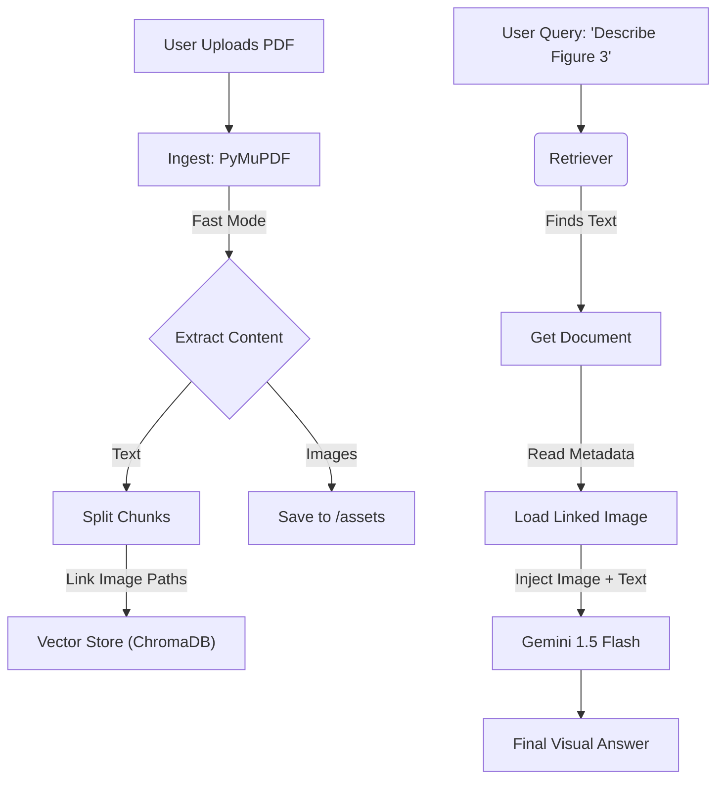

# 🧠 Deep Multimodal RAG with Visual Intelligence

A production-grade **Retrieval Augmented Generation (RAG)** system that natively answers questions about **PDF Images, Charts, and Figures**.


## 🏗️ Architecture

The system uses a **Multi-Vector Retrieval** strategy with **Just-In-Time (JIT) Metadata Injection**.



## ✨ Features

-   **⚡ Instant Ingestion**: Uses PyMuPDF's "Fast Mode" to index documents in seconds (skips expensive Vision API calls during ingest).
-   **👁️ Visual Intelligence**: Can describe charts, graphs, and figures by looking at the *actual image* at query time.
-   **🛡️ Robust Error Handling**:
    -   Auto-detects File Locks (WinError 32).
    -   Handles API Rate Limits (429) gracefully.
    -   Multiple fallbacks for PDF processing.
-   **💬 Interactive UI**: Built with Streamlit for chat-based interaction.

## 🚀 Getting Started

### Prerequisites

-   Python 3.10+
-   Google API Key (Gemini)

### Installation

1.  **Clone the Repository**
    ```bash
    git clone https://github.com/architpr/bot-with-image-.git
    cd bot-with-image-
    ```

2.  **Install Dependencies**
    ```bash
    # Create virtual environment
    python -m venv venv
    .\venv\Scripts\Activate.ps1

    # Install packages
    pip install -r requirements.txt
    ```

3.  **Setup API Keys**
    Create a `.env` file:
    ```env
    GOOGLE_API_KEY=your_gemini_api_key_here
    ```

4.  **Run the App**
    ```bash
    streamlit run app.py
    ```

## 📂 Project Structure

| File/Folder | Description |
| :--- | :--- |
| `app.py` | Main Streamlit Application interface. |
| `src/chain.py` | **Heart of the Logic**. Defines the Multimodal RAG Chain. |
| `src/visual_processor.py`| **Fast Ingestion Engine**. Handles PDF->Text+Image linking. |
| `src/vectorstore.py` | Manages ChromaDB persistence and retrieval. |
| `data/assets` | Stores extracted page images (not committed to git). |

## 🛠️ Tech Stack

-   **LLM**: `models/gemini-flash-latest` (Google GenAI)
-   **Vector DB**: ChromaDB
-   **PDF Engine**: PyMuPDF (Fitz)
-   **Indexing**: LangChain Multi-Vector
-   **UI**: Streamlit

---

